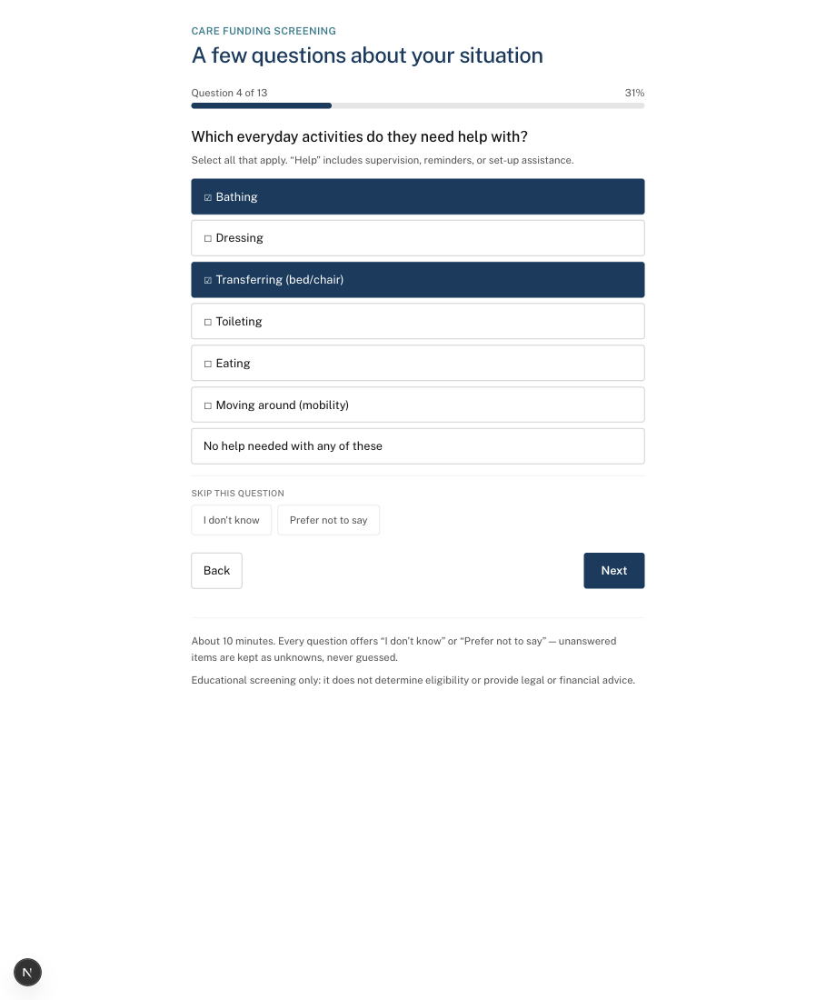
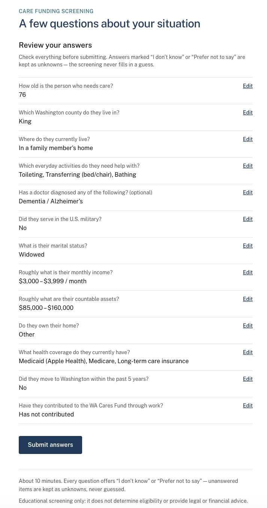
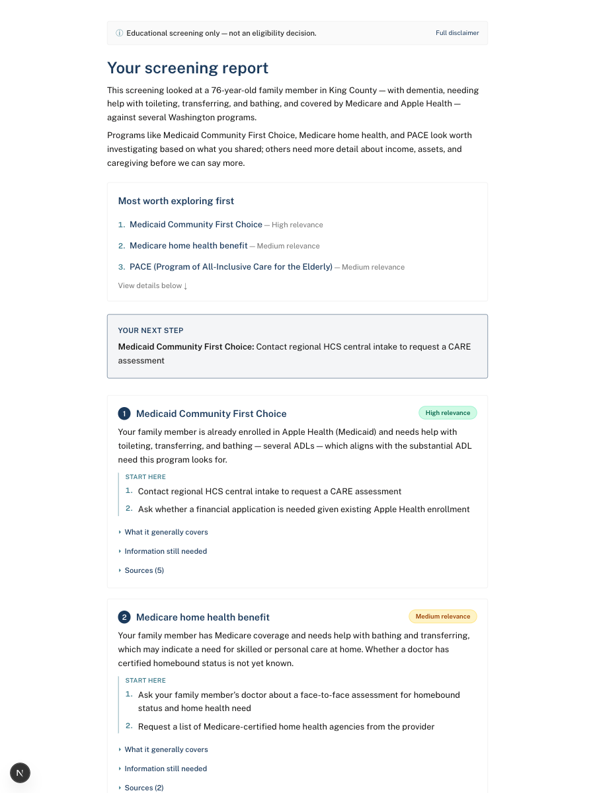
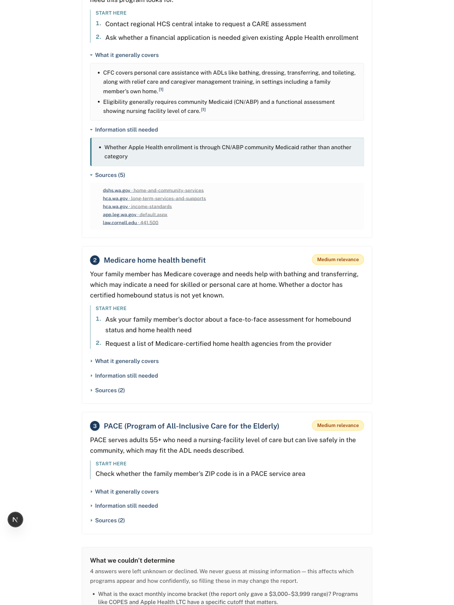

# CareNav

[](https://github.com/lonivrad/carenav/actions/workflows/ci.yml)

An educational screening tool that helps Washington families identify which
long-term care funding programs may be worth exploring with a professional.

CareNav does **not** determine eligibility, provide legal or financial
advice, or estimate benefit amounts. Every report carries that disclaimer,
and the system is built so it structurally cannot overstate: eligibility
logic is deterministic and auditable, every factual claim cites a curated
source passage, and missing answers surface as explicit unknowns rather
than guesses.

## The product

CareNav helps a family figure out which Washington long-term-care funding
programs are worth exploring, before they spend hours researching ones that
don't apply.

**Who it's for.** An adult child helping an aging parent, usually mid-crisis: a
hospital is discharging a parent in days, or a fall just ended "managing at
home." They aren't benefits experts. They discover these programs one at a
time, from pages written for caseworkers, while doing everything else a hard
week demands. The job they're hiring CareNav for is orientation: which programs
are even worth my time, in plain language.

**A deliberate scope note.** From what I saw in the ER, the deepest pain for
these families is often further downstream, in the applications themselves and
in getting a straight answer on whether a parent qualifies. CareNav does not
try to solve those, on purpose. Determination depends on assessments no
questionnaire can run (the state CARE assessment, a VA medical exam), and
applications are a heavier build. CareNav targets orientation because it's the
slice an automated, cited, honest tool can do well and safely, and because
orienting a family faster is what unblocks them to reach the professional who
handles the rest. The handoff isn't a limitation bolted on; it's the point.

The benefits professional who makes the actual determination is a downstream
recipient of the report, not a user I've designed for yet. Whether the report
is genuinely useful to them is a hypothesis I want to test, not a claim I can
currently stand behind.

**What I deliberately did not build, and why.** These decisions define the
product more than the features do.

- **It does not determine eligibility.** It screens for "worth exploring,"
  never "you qualify." Eligibility depends on assessments no questionnaire can
  run. Claiming determination would be wrong, a liability, and would set
  families up for a false yes. The architecture is built so the system
  structurally cannot overstate: deterministic rules, every claim cited,
  missing answers surfaced as explicit unknowns.
- **It does not guess missing answers.** Every question is skippable, and a
  skip is recorded as an unknown, not a default. A mid-crisis family won't have
  every number at hand, and a tool that quietly assumes income or assets to
  produce a cleaner result is lying to them. The "what we couldn't determine"
  section is a first-class output.
- **It is Washington-only, twelve programs.** Funding rules are state-specific
  and change often. A shallow fifty-state version would be confidently wrong; a
  deep single-state version can cite primary sources. Depth over coverage was
  the call.
- **It does not persist reports server-side.** Reports live only in the browser
  session, trading shareable links and refresh-recovery for never holding a
  family's health and financial answers on a server. For this data,
  no-PHI-at-rest was worth the UX cost.
- **It accepts a known recall cost in retrieval.** Passages are scoped to the
  program they belong to, so a citation can never point at another program's
  document, even though this occasionally misses a cross-program passage a
  human would find relevant. A tool whose whole promise is "every claim is
  sourced" cannot afford a citation pointing at the wrong source.

**How I'd measure success.** North star: time-to-oriented-shortlist, from "I
don't know what exists" to "here are three or four programs worth a
professional's time, with sources," in one sitting instead of hours over weeks.
Supporting metrics: intake completion rate, whether a benefits professional
would call the shortlist a reasonable starting point, unknowns surfaced
honestly rather than guessed (currently 100%), and family-reported trust (not
yet instrumented). Guardrails that must never regress, and are treated as
release gates: hallucinated-program rate (0%), citation validity (100%),
refusal correctness.

**Honest status:** this is pre-user-testing. I have not yet put CareNav in
front of real families or benefits professionals. Everything above is a
designed hypothesis. The evaluation to date measures whether the system
faithfully does what it intends (fidelity) and, through a blind labeling pass,
whether some underlying rules were actually correct (they weren't, in nine
cases, which I fixed). It does not yet measure whether the product helps a real
person.

The assumptions I most need to test, roughly by risk:

- That solving orientation is valuable even though it isn't the deepest pain.
  The deeper pain is applications and determination; the bet is that orienting
  a family quickly and honestly still saves real time and unblocks the handoff.
  If not, the product should move downstream.
- That a hedged, cited shortlist reduces a family's time and anxiety rather
  than just adding a step before they call a professional anyway.
- That families will complete a ten-minute intake mid-crisis instead of
  abandoning it.
- That "educational, not a determination" is a position families accept, when
  what they emotionally want is a yes or no.
- That the report is useful to a benefits professional rather than something
  they'd re-verify from scratch. (Untested, which is why the professional is a
  hypothesis, not a designed-for user.)

What would make me pivot or kill:

- If families tell me orientation was never the hard part and CareNav just
  added a step before the paperwork, it moves downstream toward guided
  applications, where I saw more of the pain.
- If families won't finish the ten-minute intake, the flow is too long and gets
  cut down or restructured.
- If benefits professionals won't treat the output as a trustworthy starting
  point, its ceiling as a family-facing tool is capped and it either pivots
  professional-facing or refocuses on the handoff.

## The problem

Long-term-care funding in Washington is fragmented across at least a dozen
programs — Medicaid waivers (COPES, CFC), institutional Apple Health, the
WA Cares Fund, two VA pension enhancements, two Medicare benefits, PACE,
TSOA, MAC, and respite programs — each with its own agency, eligibility
rules, income and asset standards, and application path.
Caregiver accounts suggest this research can consume many hours spread over
weeks (figures like "15+ hours" circulate; treat any such number as
illustrative — I haven't sourced a rigorous estimate). A screening takes
roughly 30 minutes (illustrative), from questionnaire to a cited, prioritized
shortlist a family can take to a benefits professional.

## Architecture

```
Intake
  ↓
Rules engine
  ↓
Candidate programs
  ↓
Retrieval (top-k = 5)
  ↓
LLM explanation
  ↓
Cross-check + citations
  ↓
Report UI
```

## Current status

v1, measured against the latest committed evaluation baseline
(`eval/results/results.md`):

- Explanation reasoning effort: **low**
- Evaluation size: **100 synthetic cases**
- Mean latency: **44.2 s** · p95 latency: **57.5 s**
- Mean cost per report: **$0.107** · total evaluation cost: **$10.62**
- Hallucinated-program rate: **0%**
- Citation validity: **100%**
- Refusal correctness: **99.0%** (the single flag is a strict-metric edge case —
  a borderline bare-"if" conditional, not an eligibility assertion)
- Pipeline failures: **1/100** — the cross-check refused to serve a report with
  an uncited claim, the designed safety behavior firing under model variance

## Workflow

```
family answers intake (~10 min, every question offers "I don't know")
      │
      ▼
deterministic rules narrow 12 programs to candidates     (src/lib/rules/)
      │        excluded programs never reappear
      ▼
program-scoped retrieval pulls passages from the         (src/lib/rag/)
curated corpus for each candidate
      │
      ▼
LLM explains and prioritizes ONLY those candidates,      (src/lib/llm/)
citing retrieved passages; output is schema-validated
and mechanically cross-checked
      │
      ▼
family reviews the report — then takes it to a benefits
professional, who makes any actual determination
```

## What it looks like

**Intake** asks one plain-language question at a time (about 10 minutes).
Answers can be a numeric age, a single choice, or a multi-select — including
multiple diagnoses. Every question can be skipped: the "I don't know" and
"Prefer not to say" actions are shown as secondary "Skip this question"
controls, and a skipped answer is recorded as an explicit unknown, never a
guess. A review step lists every answer before submitting.





**The report** opens with the programs most worth exploring first — a ranked
index that links to each program — followed by a single "Your next step"
drawn from the highest-ranked program's own next actions. Each program is a
numbered card (matching the index) with a one-line reason it may apply, its
next steps shown inline, and collapsible sections for what it generally
covers, information still needed, and sources. Every factual claim links to a
cited source passage. A closing "What we couldn't determine" section groups
the answers left unknown, so a family can see what would sharpen the result.





The layout is responsive and readable on a phone:


## Design principles

- Built for adult children helping aging parents, older adults, and families
  navigating stressful care and funding decisions.
- Calm, government-adjacent, operational design — deliberately not
  startup-marketing aesthetics.
- Large typography and strong contrast for legibility.
- Accessible: keyboard support with visible focus, native disclosure
  controls, no dark mode.
- Educational only — it never determines eligibility.
- Never guesses missing information; unanswered questions surface as explicit
  unknowns.

## Known limitations

- Washington State programs only.
- Educational screening only — not legal, financial, or eligibility advice.
- Program administrators (DSHS, the Health Care Authority, Medicare, the VA,
  and the local Area Agency on Aging) make the final eligibility decisions.
- Evaluation uses synthetic cases whose ground truth derives from the
  deterministic rules engine.
- Latency is about 40 seconds per report (mean 39.4 s, p95 51.7 s over the
  committed 100-case baseline). Sub-10-second latency is **not** achievable
  under a citation-validated architecture: a single fully-cited, multi-program
  generation dominates wall-clock, while retrieval, embedding, and assembly add
  only ~3 s. The intended mitigation is a UX one — setting expectations up front
  and showing a progress indicator while the report is produced (see
  `docs/evaluation.md`) — not a smaller number.
- `POST /api/screen` is rate limited per IP (default 5 requests/minute) because
  each report spends real money on paid APIs; exceeding it returns `429` with a
  `Retry-After` header. The limiter is in-memory, so under multi-instance or
  serverless deployment the effective limit is per instance, not global.
- Reports live only in the browser session (`sessionStorage`), never persisted
  server-side. This is a deliberate privacy tradeoff — no PHI leaves the
  browser — at the cost of no shareable report link and no recovery after a
  refresh or tab close.

## Quickstart

```bash
npm install
cp .env.example .env.local    # fill in ANTHROPIC_API_KEY and VOYAGE_API_KEY
npm run dev                   # http://localhost:3000 — start at /intake
```

Heads-up: generating a report calls paid APIs and takes ~40 s (~$0.11 per
report at list prices).

Other commands:

```bash
npm test              # unit + boundary tests (colocated *.test.ts)
npm run ingest        # rebuild the RAG index from src/data/corpus/
npm run eval          # 100-case evaluation harness — paid APIs, ~$11 and
                      # ~13 min per full run (use -- --limit N to sample)
npm run eval:generate # regenerate the synthetic test set
npm run build         # production build
```

`/baseline` hosts a deliberately primitive keyword-search comparator used by
the evaluation harness.

## Documentation

- [Architecture](docs/architecture.md) — the three-layer design and why
  deterministic logic is separated from generated language.
- [Governance](docs/governance.md) — what CareNav does and does not do,
  trust boundaries, failure modes and mitigations.
- [Evaluation](docs/evaluation.md) — methodology, current results, the
  independent labeling pass, and known limitations (including latency).
- [Accessibility](docs/accessibility.md) — the automated axe-core audit,
  contrast ratios for the palette, and keyboard/focus confirmation.
